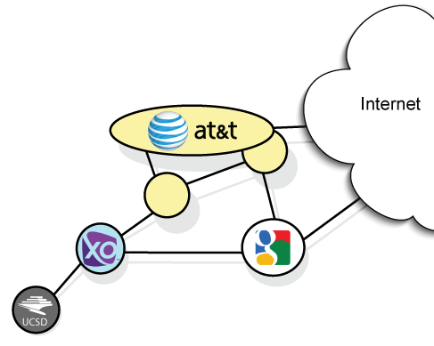
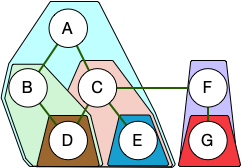

# How the Internet assigns and uses Autonomous Systems (ASes)

## 1 Learning Objectives

The goal of this assignment is to understand Autonomous Systems, how organizations use them, and the concept of an AS's _customer cone_ by processing data sets that describe how ASNs are globally distributed across networks and countries.

```
nids-asn-introduction
├- README.md                    # This document
└- report.md                    # final report template (you need to complete)
```

You can find a glossy of terms at the bottom of the report.

## 2 Introduction

Large backbone networks that route traffic for others—often referred to as transit providers—serve thousands of clients. Consequently, they require significantly more complex routing logic than smaller edge networks that have few or no downstream clients.

**What You Will Do**
In this assignment, you will analyze datasets that map the macroscopic topology of the Internet. You will examine the independent administrative domains (identified by Autonomous System Numbers, or **ASNs**) that act as the nodes in this global network graph.

Because Internet routing is largely determined by economics rather than strict shortest-path algorithms, we will be providing you with the **customer cone** for each ASN.
You can think of a customer cone as a metric that defines a node's "reach" or sphere of influence—essentially, the subset of the network graph that relies on that specific ASN for global connectivity.
This assignment will introduce you to these datasets and demonstrate how analysts use them using the prisme of an network's **customer cone**.

For this assignment, you will explore the following two datasets:

- **AS to Organization** - Provides a list of organizations, their names, country, and the ASNs they have registered in the Internet Registries. [ [webpage](https://catalog.caida.org/dataset/as_organizations) | [API](https://api.data.caida.org/as2org/v1/doc) ]
- **CAIDA AS Customer Cone and Relationships** — Provides an ASN's customer cone and the relationships between ASNs [ [paper](https://catalog.caida.org/paper/2013_asrank) | [webpage](https://catalog.caida.org/dataset/as_relationships_serial_1) | [download](https://publicdata.caida.org/datasets/as-relationships/serial-1/) ]

#### Optional Reading

- [Lecture: AS Relationships and Customer Cones](https://cseweb.ucsd.edu/classes/wi23/cse291-e/slides/cse291e-lecture-03.pdf) (slides)
- [Autonomous Systems Topology](https://www.caida.org/catalog/media/2016_as_intro_topology_wind/as_intro_topology_wind.pdf) (slides)
- [On the Importance of Being an AS: An Approach to Country-Level AS Rankings](https://catalog.caida.org/paper/2023_on_importance_being_as) (paper)
- [ASN 2 Organization](https://catalog.caida.org/dataset/as_organizations)
- [Autonomous system (Internet)](<https://en.wikipedia.org/wiki/Autonomous_system_(Internet)>) (Wikipedia)

## 3 Background on Autonomous Systems and "Organizations" that operate them.



An Autonomous System (or AS) is an independently operated network on the Internet — a collection of IP prefixes managed by a single administrative entity under a common routing policy. Each AS is identified by a globally unique **Autonomous System Number (ASN)**. Regional Internet Registries (RIRs), set up in the 1990s, allocate these numbers to organizations that operate network infrastructure. One organization may operate multiple ASNs, for example, to operate separate networks in different geographic regions or service tiers.

CAIDA uses WHOIS information available from Regional and National Internet Registries to infer a mapping from AS numbers to the organizations that operate them. In this section you will learn to parse CAIDA's _AS to Organizations_ dataset to analyze properties of this global numbering system.

In this module, we will be using each organization's ASNs' Customer Cone size to give a perspective on the relative importance of each organization. The ASN topology can be arranged into a business hierarchy based on the relative business relationship between the various organizations. At the bottom of this hierarchy are stub or edge organizations that only want to pay someone else for Internet access. They pay their transit providers to carry (i.e. transit) their traffic to the rest of the Internet. Each stub ASN is a **customer** of its transit **provider**s' ASN. This relationship is called a **Provider-Customer** relationship, with the customer below its provider. Each of these transit providers in turn may have a **Provider-Customer** relationship with their own set of transit providers. This chain of **Provider-Customer** links are the foundation of the ASN Customer Cone. The ASN Customer Cone includes the ASN itself and the union of ASNs in its customers' customer cones — that is, the number of ASNs reachable through the target ASN's customers.

## 4 Setup your local environment

### 4.1 Required accounts

You will not need accounts for this module.

### 4.2 Required Libraries and Software

This module uses [uv](https://docs.astral.sh/uv/), a Python package and project manager.
The following instructions can be used to install uv and the module's dependencies.

```
### Install the Python manager uv
curl -LsSf https://astral.sh/uv/install.sh | sh

### Install dependencies
uv sync
```

## 5 AS Organization Dataset

CAIDA provides a list of organizations with ASNs and the set of ASNs those organizations own. This dataset is inferred from the [Regional Internet Registry](https://en.wikipedia.org/wiki/Regional_Internet_registry) [WHOIS records](https://en.wikipedia.org/wiki/WHOIS). CAIDA provides this data through an API that requires pagination to retrieve the full dataset. The provided script, [scripts/orgs-download.py](scripts/orgs-download.py), handles this process automatically and stores the results in **data/orgs.jsonl**.

```
nids-asn-introduction
├- scripts/orgs-download.py      # downloads from as2org API (provided)
├- data/orgs.jsonl               # └ generated by orgs-download.py
├- scripts/org-table-fields.py   # gets stats from orgs.jsonl (you will write)
└- tables/org-table-fields.md    # └ generated by org-table-fields.py
```

- API: https://api.data.caida.org/as2org/v1/orgs/
- script: [scripts/orgs-download.py](scripts/orgs-download.py) will download the full set of organizations<br/>
  `uv run scripts/orgs-download.py --output data/orgs.jsonl`

### 5.1 Understanding ASN Organization Data

Your assignment is to write a script (_scripts/org-table-fields.py_) that will create a table (_tables/org-table-fields.md_) modeled on the **Organization Table** below and replace the [<u>underlined words</u>] with the values they describe.

#### Example

Given the following values: **1,4,4,5,8**:

- **[<u>min</u>]..[<u>max</u>]** ⇾ **1..8** : the minimum and maximum values for a given field
- **[<u>number uniques</u>]** ⇾ **3** : the number of unique values in the field

#### Organization Table

You will write `scripts/org-table-fields.py` and it will create `tables/org-table-fields.md`, giving you an understanding of the values in the dataset.

`uv run scripts/org-table-fields.py --output tables/org-table-fields.md data/orgs.jsonl`

| name    | type     | values                                    | description                                       |
| ------- | -------- | ----------------------------------------- | ------------------------------------------------- |
| score   | int      | [<u>min</u>]..[<u>max</u>]                    | organization sorting score's minimum and maximum  |
| orgId   | string   | [<u>number uniques</u>]                     | number of unique organization IDs                 |
| orgName | string   | [<u>number unique</u>]                      | number of unique organization names in file       |
| country | string   | [<u>number unique</u>]                      | number of unique countries identified as HQs      |
| source  | string   | [<u>number unique</u>]                      | number of unique Internet Registry sources        |
| members | [string] | [<u>min</u>]..[<u>max</u>]                    | organization's minimum and maximum number of ASNs |
| changed | date     | [<u>YYYY/MM/DD</u>] <br/> [<u>YYYY/MM/DD</u>] | last time the information changed in WHOIS        |
| date    | date     | [<u>YYYY/MM/DD</u>] <br/> [<u>YYYY/MM/DD</u>] | current record date                               |
| ts      | date     | [<u>YYYY/MM/DD</u>] <br/> [<u>YYYY/MM/DD</u>] | database record timestamp                         |

**number of organizations**: [<u>number of organizations</u>]<br/>
**number of ASNs**: [<u>number of ASNs</u>]<br/>
**sources**: [<u>list of Internet Registry</u>]

**Questions:**

1. How many unique countries appear in the dataset? What does this tell you about the global reach of the Internet?
2. What is the range of ASNs per organization (the `members` field)? What might explain why some organizations operate so many more ASNs than others?
3. Which Internet Registry sources appear in the dataset, and what geographic regions do they represent?

## 6 AS Customer Cones



The ASN customer cone is a metric used to gauge the size and influence of an Autonomous System (AS) within the global routing system. It represents the complete set of ASes that traffic can reach from a given AS by following only provider-to-customer (_p2c_) links.

We define an AS A's customer cone as:

- **AS A itself**
- **Plus all ASes reachable from A** by following only _p2c_ links in observed BGP paths.

In other words, an AS's customer cone contains itself, its customers, its customers' customers, and so on.

This construct embeds an assumption that ASes in the customer cone for AS A pay AS A—either directly or indirectly—for transit. To measure this, we denote the **size** of an AS's customer cone as the total number of ASNs found within its cone set, providing a coarse metric of that AS's footprint in the routing system.

We define an AS's customer cone size as:

- is the **total number of ASNs** in its customer cone

### 6.1 Understanding ASN Customer Cone

You will need to download CAIDA's May 2026 ASN Customer Cone (_20260501.ppdc-ases.txt.bz2_) file to the data directory. You will then write a script (_scripts/asn-customer-cone-classes.py_) that will divide the ASNs into bands based on their customer cone size.

```
nids-asn-introduction
├- data/20260501.ppdc-ases.txt.bz2       # you will download
├- scripts/asn-customer-cone-classes.py  # counts ASNs in different CC sizes
└- tables/asn-customer-cone-classes.md   # └ generated by asn-customer-cone-classes.py
```

CAIDA provides its ASN customer cone as part of the **CAIDA AS Customer Cone (Serial-1)** dataset. Follow the link below and download the file labeled **20260501.ppdc-ases.txt.bz2** and copy it to your **data** directory.

- download `https://catalog.caida.org/dataset/as_relationships_serial_1`
  - [20260501.ppdc-ases.txt.bz2](https://publicdata.caida.org/datasets/as-relationships/serial-1/20260501.ppdc-ases.txt.bz2) : Per-AS provider-peer-customer (PPDC) cones: for each AS, the set of all ASes reachable via customer links.

In ppdc-ases.txt.bz2 lines that start with a '#' are a comment. All other lines start with a single ASN followed by a list of ASNs in its customer cone.

```
# This is a comment
# 23's customer cone size is 3 and includes (23,4,1)
23 23 4 1
# 1's customer cone size is 1 and includes only itself
1 1
```

### 6.2 Understanding ASN Customer Cone Classes

Your assignment is to write `scripts/asn-customer-cone-classes.py` so that it creates the ASN Size Class table below and replaces the [<u>underlined words</u>].

```bash
uv run scripts/asn-customer-cone-classes.py --output tables/asn-customer-cone-classes.md data/20260501.ppdc-ases.txt.bz2
```

- **class**: the name of the class
- **range**: the range of values that defines the class
  - [<u>**max**</u>]: is the maximum customer cone size seen in the class
- **number of ASNs**: the number of ASNs in the class
  - **[<u>total</u>]**: is the total number of ASNs in the class
  - **[<u>percentage</u>]**: is the percentage of all ASNs in the class (??.?)

|          class | range             | number of ASNs |        precentage |
| -------------: | ----------------- | -------------: | ----------------: |
|           stub | 1                 |   [<u>total</u>] | [<u>percentage</u>] |
|  transit small | 2..10             |   [<u>total</u>] | [<u>percentage</u>] |
| transit middle | 11..1000          |   [<u>total</u>] | [<u>percentage</u>] |
|  transit large | 1001..10000       |   [<u>total</u>] | [<u>percentage</u>] |
|   transit huge | 10001..[<u>max</u>] |   [<u>total</u>] | [<u>percentage</u>] |

**Questions:**

1. What percentage of ASNs are stub ASes (customer cone size of 1)? What does this suggest about the structure of the Internet?
2. How large is the maximum customer cone? What does this tell you about the most influential ASes on the Internet?
3. How do the proportions of stub, small transit, and large transit ASes compare? What does this distribution reveal about how ASes are organized hierarchically?

## 7 How are these classes divided across countries

Your assignment is to write a script that **dynamically determines** the top 4 countries by number of transit huge ASNs, then produces a breakdown table of ASN class counts for each of those countries plus an "other" bucket for all remaining countries. The script must discover the top countries from the data — do not hardcode country names. The discovered country codes become the column headers in the generated markdown table.

```
nids-asn-introduction
├- scripts/country-cone-classes.py # you will write
└- tables/country-cone-classes.md  # └ generated by country-cone-classes.py
```

`uv run scripts/country-cone-classes.py --output tables/country-cone-classes.md -O data/orgs.jsonl -C data/20260501.ppdc-ases.txt.bz2`

| column      | description                                                          |
| ----------- | -------------------------------------------------------------------- |
| name        | class name                                                           |
| 1st country | country with the most transit huge ASNs (dynamically determined)     |
| 2nd country | country with the 2nd most transit huge ASNs (dynamically determined) |
| 3rd country | country with the 3rd most transit huge ASNs (dynamically determined) |
| 4th country | country with the 4th most transit huge ASNs (dynamically determined) |
| other       | total ASNs in all remaining countries                                |

The example table below uses numbered placeholders for column headers. Your script should replace these with the actual 2-letter country codes it discovers from the data (e.g., `US`, `CN`, `BR`).

| name | 1st                 | 2nd                 | 3rd                 | 4th                 | other                 |
| ---- | ------------------- | ------------------- | ------------------- | ------------------- | --------------------- |
| stub | [<u>total in 1st</u>] | [<u>total in 2nd</u>] | [<u>total in 3rd</u>] | [<u>total in 4th</u>] | [<u>total in other</u>] |

**Questions:**

1. Which countries have the most transit huge ASNs? What does this tell you about where Internet infrastructure is concentrated?
2. What proportion of all ASNs fall in the "other" category? What does this suggest about the geographic distribution of the global Internet?
3. Do the same countries dominate across all AS classes (stub, transit small, transit huge)? What patterns do you observe across the rows?

## Glossary

- **AS (Autonomous System)**: An independently operated network on the Internet, identified by a globally unique ASN, that manages its own routing policy.
- **ASN (Autonomous System Number)**: A unique number assigned to an AS by a Regional Internet Registry, used to identify the AS in global routing protocols.
- **Customer cone**: The set of all ASes reachable from a given AS by following only provider-to-customer links. It is used as a metric of an AS's size and influence in the routing system.
- **Provider-Customer relationship**: A business relationship in which a customer AS pays a provider AS for Internet transit — access to the rest of the Internet.
- **RIR (Regional Internet Registry)**: An organization that manages and allocates Internet number resources (IP addresses and ASNs) within a geographic region. The five RIRs are ARIN, RIPE NCC, APNIC, LACNIC, and AFRINIC.
- **WHOIS**: A query protocol used to look up registration records for Internet resources such as IP addresses, ASNs, and domain names.
